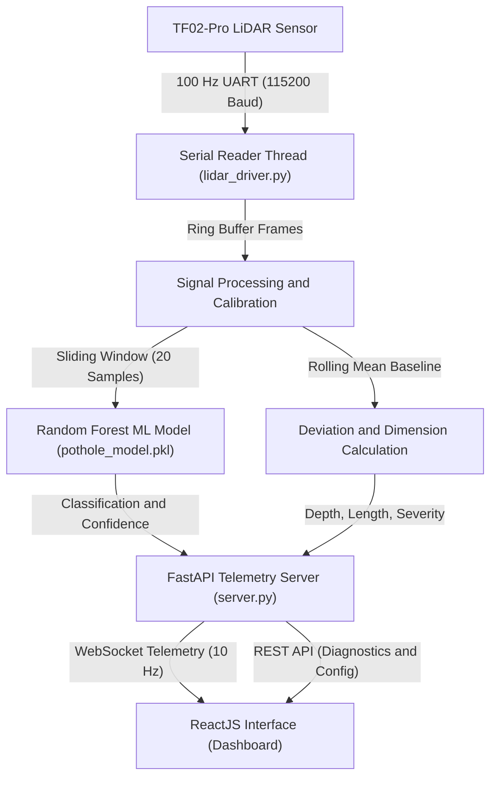

# TF02-Pro LiDAR Pothole Detection System

A real-time road surface monitoring and anomaly detection system using a Benewake TF02-Pro LiDAR sensor, machine learning classification, a FastAPI telemetry backend, and a modern ReactJS interface.

---

## Overview

The system points a TF02-Pro LiDAR downward toward the road surface from a moving vehicle.

- Normal road surface produces a stable baseline distance (for example 1000 cm).
- Potholes cause positive distance spikes (ground drops further away).
- Speed bumps cause negative distance dips (ground rises closer).
- A 100 Hz background thread reads raw sensor frames over UART serial without buffer accumulation lag.
- A rolling baseline filter tracks ground elevation shifts automatically.
- A Random Forest classifier evaluates road surface features in real time.
- Physical pothole dimensions (depth, length, width) are computed using vehicle speed.
- The ReactJS dashboard visualizes live sensor waveforms, connection state, telemetry metrics, and detection logs.

---

## System Architecture



---

## Requirements

### Hardware
- Sensor: Benewake TF02-Pro LiDAR (UART version, 5V power, 100 Hz frame rate).
- Host: Raspberry Pi 4B, Linux system, or Windows PC with USB-to-UART adapter.

### Software
- Python: Version 3.10 or higher.
- Node.js: Version 18 or higher (with npm).

---

## Quick Start

### 1. Installation

Install Python dependencies:
```bash
pip install -r requirements.txt
```

Build the ReactJS frontend:
```bash
cd frontend
npm install
npm run build
cd ..
```

### 2. Start the Application

Run the server:
```bash
python server.py
```

Open your browser and navigate to:
```
http://localhost:8000
```

### 3. Single-Command Launch (Linux / Raspberry Pi)

Make `start.sh` executable and run it from any normal terminal:
```bash
chmod +x start.sh
./start.sh
```
If executed in a normal terminal without an active virtual environment, `start.sh` automatically detects `.venv` or `venv` (or creates it if missing), switches into the virtual environment, installs any missing dependencies, and proceeds with startup.

To run with live frontend hot-reloading during development:
```bash
./start.sh --dev
```

---

## User Interface Guide

The web interface is organized into five functional sections:

### 1. Connection and Interface Panel
- Sensor Link Status: Displays whether the hardware sensor is connected, connecting, disconnected, or simulated.
- Serial Port Selection: Automatically discovers available COM and ttyUSB ports on the host system.
- Baud Rate Selection: Supports standard 115200 baud and 9600 baud.
- Connect and Disconnect Controls: Start or stop serial communications cleanly.
- Simulator Mode: Generates realistic 100 Hz road telemetry with sample potholes and bumps when hardware is disconnected.
- Health Counters: Displays thread rate (100 Hz), telemetry rate (10 Hz), total frame count, and error counter.

### 2. Telemetry Statistics Grid
- Baseline: Live ground reference distance computed as a 20-sample rolling average.
- Distance: Instantaneous raw distance reading from the LiDAR in centimeters.
- Deviation: Net road deviation (Distance minus Baseline).
- Signal Strength: Optical return reflectance amplitude from the road surface.
- Temperature: Internal sensor core temperature in degrees Celsius.
- Potholes: Cumulative count of confirmed potholes detected during the session.
- Bumps: Cumulative count of confirmed speed bumps detected during the session.
- Last Depth: Peak depth of the most recent confirmed anomaly in centimeters.

### 3. Surface Condition Banner
- Live Classification: Indicates Flat Road, Shallow Pothole, Deep Pothole, or Speed Bump.
- Confidence Score: ML model probability score for the active window.
- Streak Confirmation: Visual meter showing consecutive detection windows before firing an alert.
- Cooldown Timer: Prevents duplicate alert triggers while driving over an extended defect.

### 4. Live Sensor Waveforms
- Distance & Baseline: Dual line plot tracking sensor distance against the rolling road baseline.
- Surface Deviation: Real-time road profile with zero-line and threshold boundary indicators (+4.5 cm shallow, +8.0 cm deep, -4.5 cm bump).
- Signal Strength: Real-time optical signal quality monitor.

### 5. Anomaly Detection Event Log
- Search & Filter: Filter logs by defect type (All, Potholes, Deep Potholes, Speed Bumps) or keyword.
- Detailed Metrics: Records timestamp, classification type, deviation, depth, physical length, physical width, severity label, and ML confidence.
- Export CSV: Download the event table for post-trip reporting and road survey analysis.
- Clear Action: Reset the session event list on demand.

### 6. Hardware Diagnostics
Accessible from the top navigation bar:
- Raw 90-Byte Dump: Captures 90 raw serial bytes, validates the 0x59 0x59 header frame, and decodes distance values.
- Single Frame Test: Reads one isolated frame and outputs structured JSON metadata.

---

## Hardware Wiring

Connect the TF02-Pro cable to your USB-to-UART adapter or development board:

| TF02-Pro Wire | Function | Adapter / Board Pin |
|---|---|---|
| Red | VCC (5V Power) | 5V |
| Black | GND (Ground) | GND |
| Green | TXD (Sensor Transmit) | RXD (Adapter Receive) |
| White | RXD (Sensor Receive) | TXD (Adapter Transmit) |

Note on Linux: Ensure your user belongs to the serial group:
```bash
sudo usermod -aG dialout $USER
```

---

## Detection Logic and Machine Learning

Road anomalies are categorized into four classes:
- Class 0: Flat Road (deviation within normal sensor noise limits).
- Class 1: Shallow Pothole (positive deviation between +3 cm and +8 cm).
- Class 2: Deep Pothole (positive deviation greater than +8 cm).
- Class 3: Speed Bump (negative deviation greater than -3 cm).

### Feature Extraction
Each sliding window of 20 distance readings is transformed into a 22-element feature vector:
- Statistical moments: Mean, standard deviation, variance, skewness, kurtosis.
- Extremes: Maximum depth, minimum depth, peak-to-peak amplitude.
- Percentiles: 10th, 25th, 50th, 75th, and 90th percentiles.
- Signal strength correlation: Mean strength, standard deviation of strength.
- Geometry: Zero-crossing rate, duration above threshold.

### Retraining the Model
To retrain the Random Forest model:
```bash
python model_train.py
```
This generates `pothole_model.pkl` and `feature_meta.pkl`.

---

## REST and WebSocket API Reference

The backend exposes endpoints on port 8000:

| Method | Endpoint | Description |
|---|---|---|
| GET | `/api/status` | Current connection state, telemetry snapshot, and settings |
| GET | `/api/ports` | List available serial ports on host |
| POST | `/api/connect` | Connect to specified serial port or start simulation |
| POST | `/api/disconnect` | Disconnect sensor and stop reader thread |
| POST | `/api/settings` | Update vehicle speed, detection thresholds, and cooldown |
| POST | `/api/reset` | Clear detection counts, history buffers, and logs |
| POST | `/api/diagnostic/raw` | Execute raw 90-byte serial dump and header check |
| POST | `/api/diagnostic/frame` | Read and parse a single sensor frame |
| GET | `/api/log` | Retrieve stored detection event log entries |
| WS | `/ws` | Live 10 Hz telemetry and history broadcast |

---

## Project Structure

```
pothole_detection/
├── DL_Model/             # Optional Deep Learning pipeline
│   ├── adaptive_detector.py
│   ├── data_pipeline.py
│   ├── dl_config.py
│   ├── dl_model.py
│   ├── evaluate.py
│   ├── realtime_detector.py
│   ├── requirements.txt
│   ├── run_all.py
│   └── train.py
├── frontend/             # ReactJS web interface
│   ├── src/
│   │   ├── components/
│   │   │   ├── ConnectionPanel.jsx
│   │   │   ├── DetectionAlert.jsx
│   │   │   ├── DetectionLog.jsx
│   │   │   ├── DiagnosticModal.jsx
│   │   │   ├── LiveCharts.jsx
│   │   │   ├── Navbar.jsx
│   │   │   ├── SettingsModal.jsx
│   │   │   └── TelemetryCards.jsx
│   │   ├── App.jsx
│   │   ├── index.css
│   │   └── main.jsx
│   ├── package.json
│   └── vite.config.js
├── lidar_driver.py       # TF02-Pro serial UART driver
├── model_train.py        # Random Forest model training and feature extraction
├── pothole_model.pkl     # Serialized classifier model
├── requirements.txt      # Backend Python dependencies
├── server.py             # FastAPI backend with WebSockets and static hosting
├── start.sh              # Single-command launcher script
└── test_lidar.py         # Standalone serial connectivity test
```

---

## License

This project is released under the MIT License.
